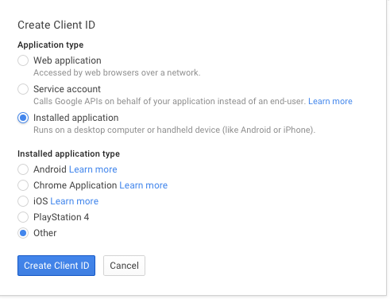

SF Elections Commission
=======================

**Disclaimer:** This repository is a personal and unofficial collection
of documents to assist with administrative tasks.  These documents are
not approved by nor do they represent the views of the City and County
of San Francisco nor the San Francisco Elections Commission.

This repository contains--

* [Backup files](web) for some pages of the Commission web site (maintained
  using San Francisco government's [Vision CMS][vision_cms]), and
* [Instructional documents](docs/index.md) for administrative tasks like
  holding a meeting and recording and posting meeting audio.

Python Setup
------------

Set up a virtualenv using Python 3.4.  Then--

    $ pip install google-api-python-client httplib2 pyyaml tweepy
    $ python scripts/run_admin.py -h

Gmail API Setup
---------------

The Python script can send e-mail using Google's [Gmail API][gmail_api].
The Gmail API is a REST APIs that uses OAuth 2.0 to handle authentication
and authorization.

The script gets needed OAuth information from a JSON file stored in the
`config` directory.  This JSON file stores an OAuth client secret, so the
file should not be checked into source control

To set up OAuth 2.0 and create or obtain the needed JSON file, log into
the [Google Developers Console][google_dev_console] using your Google
account.  Create a "Project" if necessary, and then select the project.
Inside the project management UI, go to "APIs & auth" > "Credentials."
Then select or create a new "Client ID":

The Client ID should have type "Installed application: Runs on a desktop
computer or handheld device (like Android or iPhone)."  Once created, it
will say, "Client ID for native application."  Click "Download JSON"
and save the file in the `config` directory with a name like
`google_client.secret.json`.

### Troubleshooting

If you get an error like the below saying, "deleted_client: The OAuth client
was deleted," then try following the instructions above to create a
new client ID.

      ...
      File "/Users/chris/dev/elections/sf-elections-commission/scripts/../pycomm/emailing.py", line 211, in send_message
        message = messages.send(userId='me', body=message).execute()
      File "/Users/chris/dev/.virtualenvs/sf-commission/lib/python3.4/site-packages/oauth2client/util.py", line 137, in positional_wrapper
        return wrapped(*args, **kwargs)
      File "/Users/chris/dev/.virtualenvs/sf-commission/lib/python3.4/site-packages/googleapiclient/http.py", line 722, in execute
        body=self.body, headers=self.headers)
      File "/Users/chris/dev/.virtualenvs/sf-commission/lib/python3.4/site-packages/oauth2client/util.py", line 137, in positional_wrapper
        return wrapped(*args, **kwargs)
      File "/Users/chris/dev/.virtualenvs/sf-commission/lib/python3.4/site-packages/oauth2client/client.py", line 555, in new_request
        self._refresh(request_orig)
      File "/Users/chris/dev/.virtualenvs/sf-commission/lib/python3.4/site-packages/oauth2client/client.py", line 758, in _refresh
        self._do_refresh_request(http_request)
      File "/Users/chris/dev/.virtualenvs/sf-commission/lib/python3.4/site-packages/oauth2client/client.py", line 811, in _do_refresh_request
        raise AccessTokenRefreshError(error_msg)
    oauth2client.client.AccessTokenRefreshError: deleted_client: The OAuth client was deleted.

Technical Note
--------------

To preview a file in HTML, you can run the following command, for example:

    $ pandoc --from=markdown_github --to=html --output=PATH.html PATH.md

[gmail_api]: https://developers.google.com/gmail/api/
[google_dev_console]: https://console.developers.google.com
[vision_cms]: http://www6.sfgov.org/index.aspx?page=163
