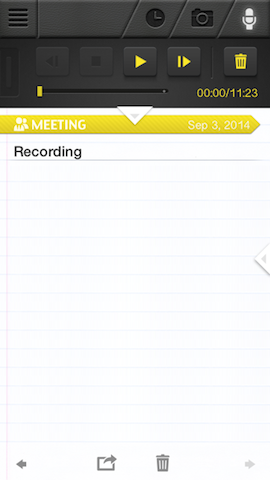

Meeting Audio
=============

This page contains instructions for recording a meeting, creating an
audio MP3, and posting the audio as a video on YouTube.

Using Mac OS X
--------------

This section contains instructions with using free Mac OS X applications.

### Record and download the audio

For recording the meeting, I found that the free iPhone app called
[Super Note][super-note] by Clear Sky Apps works well.  Here is a
screen shot:

After recording the meeting, Super Note lets you download the audio file
to your computer using DropBox.  The audio file format is [AIFF][aiff],
which is a file format created by Apple and works with iTunes, etc.
A 10-minute meeting resulted in a file less than 6MB.

### Trim the audio and create an MP3

To trim extra time from the beginning and end of the audio, open the
file in iTunes.

Then, make sure your iTunes is configured to create MP3 files (a more
widely supported audio format).  To do this, in the top menu bar,
click on "iTunes > Preferences...."  In the "General Preferences"
dialog box, click on the "Import Settings..." button.  Under
"Import Using," select "MP3 Encoder."  And under "Setting," select
"High Quality (160 kbps)."  Click "OK" and "OK" to close the dialog
boxes and return to iTunes.

To set the start and end times of the audio clip, press "CTRL + mouse-click"
on the audio file in the iTunes Music Library, and select "Get Info"
in the pull-down menu that appears.  A dialog box should appear.
Select "Options" at the top of the dialog box and manually enter start
and end times (which you can figure out by listening to the audio and
writing down the times you want).  See the picture below for a sample
screen shot of this dialog box.

Click OK to close the dialog box and return to the main iTunes window.

Press "CTRL + mouse-click" on the audio file in the iTunes Music Library
and select "Create MP3 Version."  This should create a new audio file
in the library.  The length should be shorter to reflect the new start
and end times you chose.

Press "CTRL + mouse-click" on the audio file in the iTunes Music Library
and select "Show in Finder."  Copy this MP3 file to a separate location.
This is your final audio MP3 file.  It would be a good idea to archive
this file somewhere with the Commission for backup purposes.

### Create a video file

TODO: finish these instructions.

[aiff]: http://en.wikipedia.org/wiki/Audio_Interchange_File_Format
[super-note]: http://www.clearskyapps.com/portfolio/super-note
