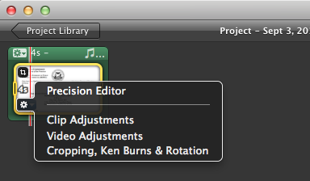
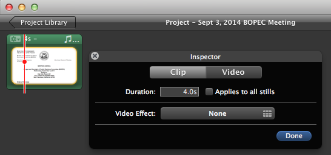

Meeting Audio
=============

This page contains instructions for recording a meeting, creating a
trimmed audio MP3 file, creating a video from the audio
(for posting on YouTube), and posting the video on YouTube.

Using Mac OS X
--------------

This section contains instructions using free Mac OS X applications.

### Record and download the audio

For recording the meeting, I found that the free iPhone app called
[Super Note][super-note] by Clear Sky Apps works well.  Here is a
screen shot:

After recording the meeting, Super Note lets you download the audio file
to your computer using DropBox.  The audio file format is [AIFF][aiff],
which is a file format created by Apple and works with iTunes, etc.
A 10-minute meeting resulted in a file less than 6MB.

### Trim the audio and create an MP3

To trim extra time from the beginning and end of the audio, open the
file in iTunes.

Then, make sure your iTunes is configured to create MP3 files (a more
widely supported audio format).  To do this, in the top menu bar,
click on "iTunes > Preferences...."  In the "General Preferences"
dialog box, click on the "Import Settings..." button.  Under
"Import Using," select "MP3 Encoder."  And under "Setting," select
"High Quality (160 kbps)."  Click "OK" and "OK" to close the dialog
boxes and return to iTunes.

To set the start and end times of the audio clip, control-click
(press "CTRL + mouse-click") on the audio file in the iTunes Music Library,
and select "Get Info" in the pull-down menu that appears.
A dialog box should appear.
Select "Options" at the top of the dialog box and manually enter start
and end times (which you can figure out by listening to the audio and
writing down the times you want).  See the picture below for a sample
screen shot of this dialog box.

Click OK to close the dialog box and return to the main iTunes window.

Control-click on the audio file in the iTunes Music Library
and select "Create MP3 Version."  This should create a new audio file
in the library.  The length should be shorter to reflect the new start
and end times you chose.

Control-click on the audio file in the iTunes Music Library
and select "Show in Finder."  Copy this MP3 file to a separate location.
This is your final audio MP3 file.  It would be a good idea to archive
this file somewhere with the Commission for backup purposes.

### Create a still image for the video

To create a video from the audio, you will need a placeholder image.
A screen shot of the top part of the agenda works well for this because
it contains information about the meeting like the time and place, etc.

For videos, we use YouTube's preferred aspect ratio of 16:9.  An image
size of 800 pixels wide by 450 tall is an example of something that works.
You can use Apple's "Preview" program to crop and resize screen shots
to a 16:9 ratio (be careful not to "stretch" the image, though).

Below is an example image with size 800 by 450.

### Create the video

This subsection says how to create a video from your image and audio file.

These instructions use iMovie '09.  They are adapted from YouTube's own
help page [here][youtube-help].

Start iMovie (e.g. by clicking on it in the "Applications" folder).
Drag the MP3 audio file into the project area.  Also drag the image file
into the audio area.  The top of your iMovie window should now look
something like the following.  The green region corresponds to the
audio file, and the picture inside the green region corresponds to
the visual image.

The imported image has a length of time associated to it
that says how long the image should display in the movie.
After dragging, this time starts out as 4 seconds, so you need to lengthen
the time of the image to match the length of the audio.

To confirm the length of the _audio clip_ in iMovie, click the green "gear"
in the upper left corner of the green box.  This lets you access
properties of the audio you imported.  Select "Clip Adjustments" in the
box that appears.

You should see a box appear that says, "Source Duration."  Note the time
duration somewhere.  This should match the duration of the original
trimmed audio you made in iTunes.

Now we will change the length of time of the image to match
the length of the audio.  To access the image properties, hover over the
image inside the green region.  A blue "gear" should appear in
the lower-left corner of the image.  Click the blue gear.

Now click "Clip Adjustments."  A dialog box should pop up that lets you
edit the image duration.

Set the duration of the image in the format `m:ss`.  Note that iMovie
seems to have an upper limit of 10 minutes for an image.
If the audio file is less than 10 minutes, set the image duration
equal to the duration of the audio.  Otherwise, set the image duration
equal to the maximum of 10:00.  We will address the audio after
10 minutes below.

Lengthening the image duration from 4 seconds to something longer
like 10 minutes might cause the green box to fill up the window as follows.

If this occurs, change the "granularity" of the project view by moving
the bar in the lower-right corner of the project window all the way to
the right to "All."

This should cause the green region to reduce back to its original size
of a single box.

By default, images imported into iMovie have a visual effect applied
to them called the "Ken Burns effect."  With this effect, the video
gradually zooms in to or out of the image over the course of the display
of the image.

To turn this feature off, hover over the image and click the blue gear
again.  This time, select "Cropping, Ken Burns & Rotation" in the menu
that pops up.  Some options should appear in the window on the right.
Select "Fit" and click "Done."  This will cause the image to remain still
over the course of its display.

If the audio file was less than 10 minutes long, you are done editing
the video.  More likely, the audio file was longer than 10
minutes long.  In this case, you need to create enough copies of
the 10-minute image to last the length of the audio.

To create enough copies of the image, click on the image so that a yellow
outline surrounds the image.  Press `COMMAND+C` to copy the image.
Then press `COMMAND+V` to paste enough copies of the 10-minute
image to span the length of the audio.  Double-check that each image
(except for the last) is exactly 10 minutes long.  You can do this by
hovering over each image.  For the last image, you should set the
duration so that it fills out the remaining length of the audio.

At this point, you are done editing and can create the final video file.
To do this, go to Share > "Export using QuickTime..."  This should
open a dialog box called "Save exported file as...".  The bottom of the
dialog box should look like the following:

Click the "Options..." button next to "Export."  In the "Movie Settings"
dialog box, click the "Settings..." button in the "Video" section.
A dialog box like the following should appear.

Change the settings to match the settings in the picture above.
These settings are set to a lower quality to make the export faster, and
because a high quality is not needed for the video.

Click OK twice to close both dialog boxes, and then click save.
This will generate a ".mov" file, which is the video format for QuickTime
and is acceptable for YouTube.  Note that the export process may take a
relatively long time.  For example, a 10-minute video may take on the
order of 10 minutes to create.

### Upload the video to YouTube

TODO

Using FFmpeg
------------

This section contains alternate instructions for converting an
audio file to video, using the open-source command-line utility
[FFmpeg][ffmpeg].

This method requires a bit more technical savvy, but the process is _MUCH_
faster (both in the number of manual steps to carry out and in waiting
for the computer to process).

For example, for a 10-minute video, this method took only about 5 seconds
of computer processing time (compared to 10 minutes using iMovie).
Also, the resulting file was much smaller (about 1/6th the size, or
7MB vs 43MB).

Install FFmpeg using MacPorts:

    $ sudo port install ffmpeg

Run the following from the command-line (filling in correct INPUT
and OUTPUT file names):

    $ ffmpeg -i INPUT.mp3 -f image2 -loop 1 -r 2 -i INPUT.png \
      -shortest -c:a copy -c:v libx264 -crf 23 -preset veryfast OUTPUT.mp4

Notes on the command above:

* `-f image2` means to use the "image2 sequence" format
* `-loop 1` means to loop over the input stream (for image streams)
* `-r 2` means 2 frames per second of the image
* `-shortest` means to use the shortest stream to determine when encoding
  should end

See [here](http://superuser.com/a/538168) for more info and where this
suggested syntax came from.

[aiff]: http://en.wikipedia.org/wiki/Audio_Interchange_File_Format
[ffmpeg]: https://www.ffmpeg.org/
[super-note]: http://www.clearskyapps.com/portfolio/super-note
[youtube-help]: https://support.google.com/youtube/answer/1696878?hl=en
