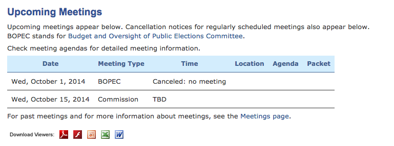

Preparing and Holding Meetings
==============================

This document contains guidance for preparing and holding a meeting:

* [72 Hours in Advance](#72-hours-in-advance)
* [How to Cancel a Meeting](#how-to-cancel-a-meeting)
* [After a Meeting](#after-a-meeting)

Prepare an Agenda
-----------------

TODO

72 Hours in Advance
-------------------

This section contains things to do at least 72 hours before each meeting.
Most of these things relate to providing notice of the meeting.
The San Francisco City Attorney's "Good Government Guide" contains more
information about providing notice.

### 1. Commission web site

Post the agenda and agenda packet documents on the Commission website.

### 2. SF Public Library

E-mail the agenda to the San Francisco Public Library's [Government
Information Center][gov-info-center] at <sfdocs@sfpl.org>.
It is not necessary to e-mail the agenda packet.  The Government
Information Center is located on the fifth floor of the main library.
The Center will include the agenda in a binder on their main desk.

### 3. Bulletin Boards

Post a paper copy of the agenda on the bulletin board outside the
meeting room in City Hall and on the bulletin board outside the
Department of Elections office.

### 4. E-mail

TODO

How to Cancel a Meeting
-----------------------

1. Prepare a meeting cancellation notice per Section 67.6(g) of the Sunshine
   Ordinance:

> (g) If a meeting must be canceled, continued or rescheduled for any
reason, notice of such change shall be provided to the public as soon
as is reasonably possible, including posting of a cancellation notice

Create a PDF of this document.  See the [`templates`](templates) directory
for a sample document.

2. Update the "Upcoming Meetings" table on the Commission home page
   wording like, "Canceled: no meeting."

3. Tweet the meeting cancellation.  Here is a sample:
   https://twitter.com/SFElectionsComm/status/515617594381205505

4. E-mail the PDF of the meeting cancellation notice to the San Francisco
   Public Library's Government Information Center, as you would for a
   normal meeting.

5. Send a courtesy e-mail about the cancellation to the Commission or
   committee members, Director of Elections, and Deputy City Attorney,
   as you would for a meeting that was being held.

After a Meeting
---------------

After a meeting, do the following--

1. Follow the instructions [here][post_audio] to convert the meeting
   audio to a video and post it on YouTube.
2. Create draft minutes.

On the Commission website--

1. Complete the [Commissioner attendance grid][attendance-grid] for the meeting.
2. If draft minutes were approved at the meeting, then make sure the
   finalized minutes are stored on the website (under the Document
   Central folder for that meeting).  Make sure the final minutes
   are linked to in the [Past Meetings][past_meetings] grid (without
   the word "Draft" in the description).  Then Tweet that the
   approved minutes are now posted.
3. Move the information for the meeting from
   [Upcoming Meetings][upcoming_meetings] to [Past Meetings][past_meetings].
4. Add a row for the next upcoming meeting to Upcoming Meetings.
5. Add a link to the YouTube video in the Past Meetings grid, and then
   Tweet a link to the YouTube video.
6. Upload the draft minutes to the website, add a link to the draft minutes
   to the Past Meetings grid, and then Tweet the availability of the
   draft minutes with a link to the Past Meetings page.

[attendance-grid]: http://www.sfgov2.org/index.aspx?page=2918
[gov-info-center]: http://sfpl.org/index.php?pg=0200002601
[home-page]: http://www.sfgov2.org/index.aspx?page=319
[past_meetings]: http://www.sfgov2.org/index.aspx?page=1382
[post_audio]: https://github.com/cjerdonek/sf-elections-commission/blob/master/docs/audio.md
[upcoming_meetings]: http://www.sfgov2.org/index.aspx?page=319
